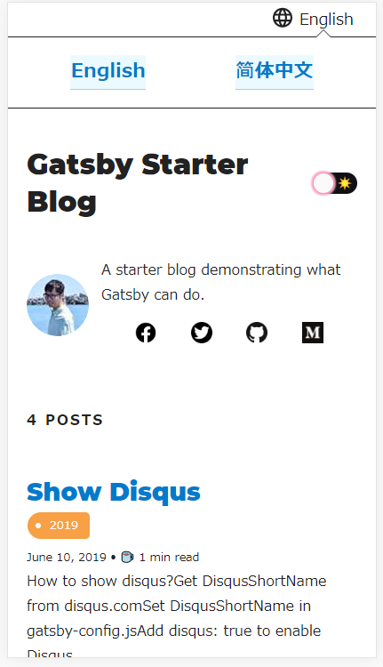
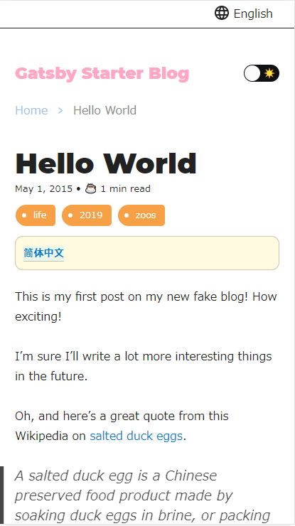
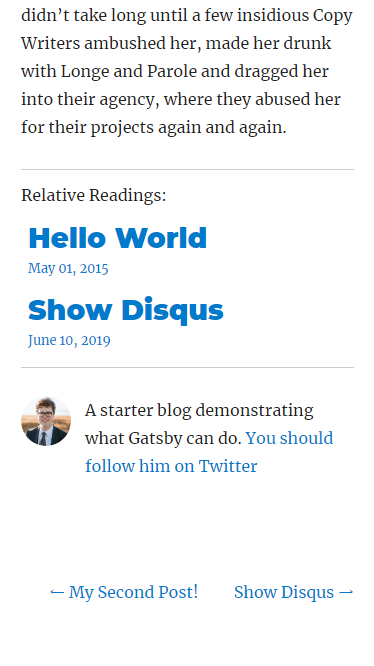
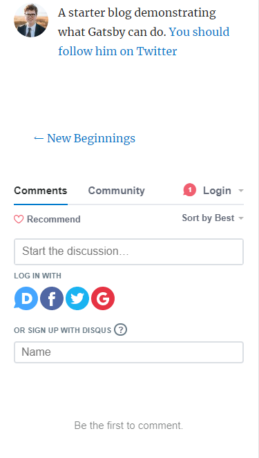

<h1 align="center">gatsby-simple-blog</h1>

[](https://travis-ci.org/thundermiracle/gatsby-simple-blog)
[](https://david-dm.org/thundermiracle/gatsby-simple-blog)
[](https://circleci.com/gh/thundermiracle/gatsby-simple-blog)
[](https://app.netlify.com/sites/kind-thompson-8554b1/deploys)

## Description

A gatsbyjs starter forked from gatsby-starter-blog and applied overreacted lookings, with tags and breadcrumbs, eslint, relative posts, disqus, i18n, eslint supported.

## Sample pages

[Github-Pages](https://thundermiracle.github.io/gatsby-simple-blog/)

[Netlify](https://gatsby-simple-blog.thundermiracle.com/)

## How to use

```sh
npm install -g gatsby-cli

gatsby new my-blog-folder https://github.com/thundermiracle/gatsby-simple-blog
```

## How to deploy by Circle-CI in Medium.com

[Medium.com -- Deploy Static Sites to Netlify by Circle-CI](https://medium.com/@thundermiracle/deploy-static-sites-to-netlify-by-circle-ci-ab51a0b59b73?source=friends_link&sk=095db82e2f8e8ef91d03a171f217e340)

## Configuration

All configurable values are here: __./config/index.js__

## i18n

1. Add [lang].js to config/locales folder

1. Modify supportedLanguages in config/index.js

1. Set site.lang in config/index.js as default language

1. add [filename].[lang].md to content/blog and enjoy!

## Features

* ## __i18n__

  Display multiple language. (Only be shown when supportedLanguages > 1)

  

  Display language link in every post. (You can disable it in config/index.js by displayTranslations: false)

  

* ## __overreacted design__

  [overreacted.io](https://overreacted.io/) lookings

  

  

* ## __Tags__

  Display articles in same tag.

  

  

* ## __Breadcrumbs__

  Display breadcrumbs in header part.

  

* ## __Relative posts__

  Display previous and next posts in same tag in footer part.

  

* ## __Disqus__

  Use disqus.com to enable comment.

  

* ## __eslint__

  Enable eslint for better coding experience.

* ## __module resolver__

  Enable babel-module-resolver to prevent relative path hell

## License

This project is licensed under the terms of the [MIT license](/LICENSE).
