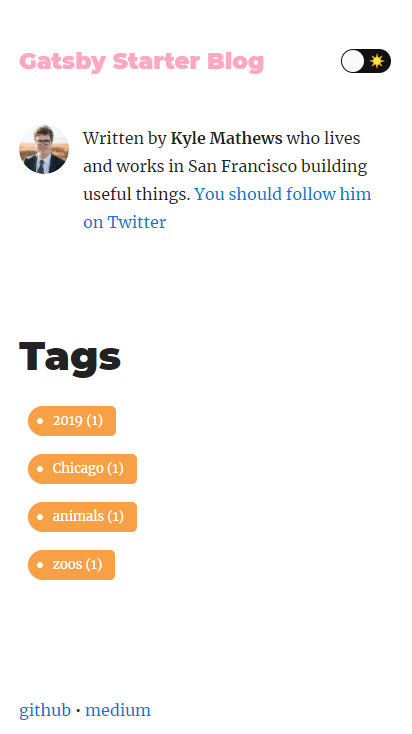

<h1 align="center">gatsby-simple-blog</h1>

## Description

A gatsbyjs starter forked from gatsby-starter-blog and applied overreacted lookings, with tags and breadcrumbs, eslint supported.

## How to use

```sh
npm install -g gatsby-cli

gatsby new my-blog-folder https://github.com/thundermiracle/gatsby-simple-blog
```

## Images





## License

This project is licensed under the terms of the [MIT license](/LICENSE).
